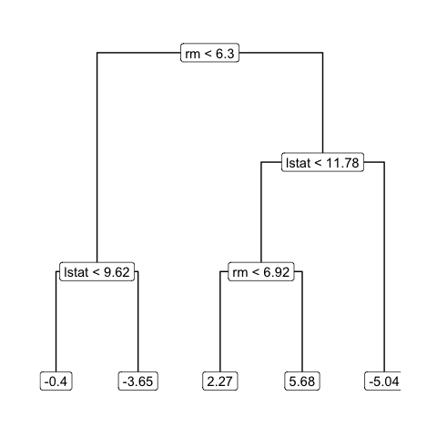

<!--- README.md is generated by rmarkdown: README.Rmd. Please edit that file. -->
`eatmyshorts`
=============

Visualisation methods and functions for exploring Bayesian Additive Regression Trees (BART). See [BART on CRAN](https://CRAN.R-project.org/package=BART), in particular the vignette.

This package is currently under development. Slides from OzViz 2019 workshop on `eatmyshorts` are available [here](https://bonstats.github.io/ozviz2019/slides.html).

The first occurrence of the famous "eat my shorts" catch phrase was in S01E02 of The Simpsons. In this episode Edna Krabappel also says "visualise it BART" when Bart is having problems with a aptitude test. [This clip](https://youtu.be/6Jq_9ghf-jI) from the episode summarises how I sometimes feel about visualising BART models.

Example usage of package
========================

Below is a walk through of the packages current capabilities, and will be updated as the package develops.

Boston Housing example (from `BART` vignette)
---------------------------------------------

First we fit the BART model on two variables (for simplicity). Note that we are only returning 5 trees from the 1000 post-burnin samples, and only using 10 trees in total.

``` r
suppressPackageStartupMessages({
library(eatmyshorts)
library(dplyr)
library(ggplot2)
library(BART)
library(tidytree)
})

Boston <- MASS::Boston

X <- Boston[, c(6, 13)]
y <- Boston$medv

set.seed(99)
bart_model <- wbart(x.train = X, 
                  y.train = y, 
                  nskip = 1000, 
                  ndpost = 1000,
                  nkeeptreedraws = 5, # keep only 5 mcmc iteration sum-of-trees
                  ntree = 10, # use only 10 trees in each iteration (default 200)
                  printevery = 1000
                  ) 
```

The current methods for extracting the trees from the `BART` models are summarise below.

``` r
# Current methods for extracting trees:

tidytree_simple <- as_tidytree(bart_model)

tidytree_simple
```

    ## # A tibble: 182 x 5
    ## # Groups:   iter, tree_id [50]
    ##     iter tree_id  node parent label        
    ##    <int>   <int> <int>  <int> <chr>        
    ##  1     1       1     1     NA rm < 6.3     
    ##  2     1       1     2      1 -1.06        
    ##  3     1       1     3      1 lstat < 11.78
    ##  4     1       1     6      3 -0.3         
    ##  5     1       1     7      3 -4.07        
    ##  6     1       2     1     NA rm < 7.64    
    ##  7     1       2     2      1 4.75         
    ##  8     1       2     3      1 8.7          
    ##  9     1       3     1     NA lstat < 16.44
    ## 10     1       3     2      1 -0.35        
    ## # … with 172 more rows

``` r
tidytree_detailed <- as_tidytree(
  bart_model, 
  extra_cols = c("var", "cut", "leaf_value", "is_leaf")
  )

tidytree_detailed
```

    ## # A tibble: 182 x 9
    ## # Groups:   iter, tree_id [50]
    ##     iter tree_id  node parent label         var     cut leaf_value is_leaf
    ##    <int>   <int> <int>  <int> <chr>         <chr> <dbl>      <dbl> <lgl>  
    ##  1     1       1     1     NA rm < 6.3      rm     6.30     NA     FALSE  
    ##  2     1       1     2      1 -1.06         <NA>  NA        -1.06  TRUE   
    ##  3     1       1     3      1 lstat < 11.78 lstat 11.8      NA     FALSE  
    ##  4     1       1     6      3 -0.3          <NA>  NA        -0.300 TRUE   
    ##  5     1       1     7      3 -4.07         <NA>  NA        -4.07  TRUE   
    ##  6     1       2     1     NA rm < 7.64     rm     7.64     NA     FALSE  
    ##  7     1       2     2      1 4.75          <NA>  NA         4.75  TRUE   
    ##  8     1       2     3      1 8.7           <NA>  NA         8.70  TRUE   
    ##  9     1       3     1     NA lstat < 16.44 lstat 16.4      NA     FALSE  
    ## 10     1       3     2      1 -0.35         <NA>  NA        -0.351 TRUE   
    ## # … with 172 more rows

``` r
tidygraph_detailed <- as_tidygraph_list(
  bart_model, 
  extra_cols = c("var", "cut", "leaf_value", "is_leaf"))

tidygraph_detailed[1:2]
```

    ## [[1]]
    ## # A tbl_graph: 5 nodes and 4 edges
    ## #
    ## # A rooted tree
    ## #
    ## # Node Data: 5 x 8 (active)
    ##    node label         var     cut leaf_value is_leaf  iter tree_id
    ##   <int> <chr>         <chr> <dbl>      <dbl> <lgl>   <int>   <int>
    ## 1     1 rm < 6.3      rm     6.30     NA     FALSE       1       1
    ## 2     2 -1.06         <NA>  NA        -1.06  TRUE        1       1
    ## 3     3 lstat < 11.78 lstat 11.8      NA     FALSE       1       1
    ## 4     4 -0.3          <NA>  NA        -0.300 TRUE        1       1
    ## 5     5 -4.07         <NA>  NA        -4.07  TRUE        1       1
    ## #
    ## # Edge Data: 4 x 2
    ##    from    to
    ##   <int> <int>
    ## 1     1     2
    ## 2     1     3
    ## 3     3     4
    ## # … with 1 more row
    ## 
    ## [[2]]
    ## # A tbl_graph: 3 nodes and 2 edges
    ## #
    ## # A rooted tree
    ## #
    ## # Node Data: 3 x 8 (active)
    ##    node label     var     cut leaf_value is_leaf  iter tree_id
    ##   <int> <chr>     <chr> <dbl>      <dbl> <lgl>   <int>   <int>
    ## 1     1 rm < 7.64 rm     7.64      NA    FALSE       1       2
    ## 2     2 4.75      <NA>  NA          4.75 TRUE        1       2
    ## 3     3 8.7       <NA>  NA          8.70 TRUE        1       2
    ## #
    ## # Edge Data: 2 x 2
    ##    from    to
    ##   <int> <int>
    ## 1     1     2
    ## 2     1     3

The `tidytree` method returns a `tbl_tree` (special `tibble`) grouped by MCMC iteration and tree number, whilst the `tidygraph` method returns a list of `tbl_graph` which inherit from the `igraph` structure.

By using the `ggraph` and `tidygraph` package together, we can do some simple plotting.

``` r
library(ggraph)

  ggraph(tidygraph_detailed[[31]], 'dendrogram') + 
    geom_edge_elbow() + 
    geom_node_label(aes(label = label)) +
    theme_graph()
```



This only plots 1 tree from 1 iteration of the BART MCMC. How do we extend it?
